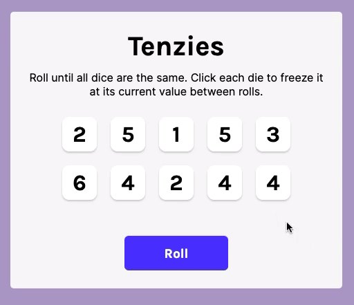

# Tenzies, dice game

<h3>🎲 <b>How to play: </b> </h3>
- Roll until all dice are the same number 
- Click each die to freeze it at its current value between rolls 

---

<h3>⭐️ <b>Features:</b></h3>
- Can play unlimited times 
- Confetti surprise when the game ends (indicating the user won)

---

<h3><b>Objectives:</b></h3>

- Use the React library to create the User Interface as it would handle the updating of the DOM as required.

- Install and learn to use npm packages such as:

        nanoid: A tiny, secure, URL-friendly, unique string ID generator for JavaScript.

        react-confetti: Confetti without the cleanup.

---

 

